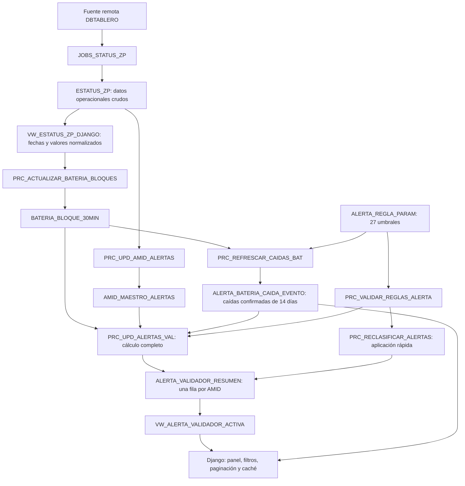

# 03 — Flujo completo Oracle–Django

## Objetivo

Este documento explica qué función cumple Oracle dentro del dashboard, cómo se transforman los datos operacionales y dónde se calculan las reglas de alertas GPS y batería.

También propone una estrategia para que Django consulte resultados preparados, evitando leer y procesar repetidamente los mismos registros.

La idea central es la siguiente:

> Oracle concentra la ingestión, normalización y agregación de los datos. Django autentica usuarios, recibe filtros y presenta resultados ya calculados.

---

## Resumen para presentación

El principio del diseño es:

> Oracle procesa y conserva resultados; Django autentica, filtra y presenta.



Hay dos caminos al cambiar una regla:

| Tipo | Qué cambia | Proceso |
|---|---|---|
| `CLASIFICACION` | El nivel asignado a métricas existentes | Validación y `PRC_RECLASIFICAR_ALERTAS`; tarda pocos segundos. |
| `DETECCION` | Qué eventos se consideran caídas o eventos válidos | Validación y `PRC_RECALCULAR_ALERTAS_SEGURO`; relee la ventana histórica. |

`ESTATUS_ZP` y `JOBS_STATUS_ZP` son objetos preexistentes que esta optimización
no modifica. Los índices autorizados se revisaron, pero no fue necesario crear
otros nuevos.

## Responsabilidad de Oracle

Oracle cumple cuatro funciones principales:

1. Recibir o copiar estados de validadores desde la fuente remota.
2. Normalizar fechas y valores que originalmente llegan como texto.
3. Preparar estructuras de consulta eficientes, como los bloques de batería de 30 minutos.
4. Calcular un resumen de alertas por AMID para que el dashboard no recalcule eventos en cada solicitud.

SQLite no reemplaza estas funciones. En este proyecto se utiliza únicamente para datos internos de Django, como usuarios, permisos, sesiones, migraciones y logs locales.

---

## Flujo operativo

Los jobs programados ejecutan la preparación de bloques y el cálculo completo
cada 30 minutos. Django nunca recorre todo el histórico para construir el Panel
Alertas: consulta la vista activa, que expone una sola fila por AMID.

Las cuatro estructuras de lectura son:

- `VW_ESTATUS_ZP_DJANGO`, para detalle GPS y último estado normalizado;
- `BATERIA_BLOQUE_30MIN`, para tablas y gráficos de batería;
- `ALERTA_BATERIA_CAIDA_EVENTO`, para el detalle oficial de cada caída;
- `VW_ALERTA_VALIDADOR_ACTIVA`, para el panel y los totales de alertas.

Los totales del panel se mantienen 60 segundos en la caché local de Django. La
caché se invalida inmediatamente después de una aplicación manual de reglas.

---

## Objetos principales

### `ESTATUS_ZP`

Es la tabla de entrada operacional del esquema `USR_LAB`.

Contiene los estados obtenidos desde:

- `DBTABLERO.ANTENA_TABLERO@CLEAMTT3PRO`.
- `DBTABLERO.ESTADO_DS_TABLERO@CLEAMTT3PRO`.

Entre sus datos están el AMID, fechas, bus, operador, patente, versiones, coordenadas GPS, porcentaje de batería y estados de los sensores.

Actualmente varios valores funcionalmente numéricos o de fecha se guardan como `VARCHAR2`. Esto obliga a normalizarlos cada vez que se consulta la vista de Django.

### `VW_ESTATUS_ZP_DJANGO`

Es la interfaz normalizada entre la información cruda y los procesos del dashboard.

Sus tareas principales son:

- Convertir fechas de texto a `DATE`.
- Reconocer más de un formato de fecha.
- Entregar `NULL` cuando un valor no es válido.
- Exponer las columnas con los nombres esperados por los servicios Python.
- Generar un identificador utilizando el `ROWID` de `ESTATUS_ZP`.

La vista facilita el consumo desde Django, pero las conversiones con expresiones regulares y `TO_DATE` tienen un costo si se repiten sobre un volumen grande.

### `BATERIA_BLOQUE_30MIN`

Almacena una fila por cada combinación de AMID y bloque de 30 minutos.

Permite distinguir correctamente entre:

- Ausencia de transmisión: `PORCENTAJE_BATERIA IS NULL` y `TIENE_DATO = 0`.
- Un valor real de batería cero: `PORCENTAJE_BATERIA = 0` y `TIENE_DATO = 1`.

Esta distinción es importante: un dato ausente no debe interpretarse como batería descargada.

El procedimiento `PRC_ACTUALIZAR_BATERIA_BLOQUES`:

1. Genera la grilla de bloques de media hora.
2. Busca el registro más cercano para cada AMID y bloque.
3. Acepta registros con una diferencia máxima de 15 minutos.
4. Si existen varios candidatos, conserva el más cercano; ante empate, el más reciente.
5. Actualiza o inserta los bloques mediante `MERGE`.
6. Elimina por defecto los bloques con más de 16 días.

Procesa dos días por defecto, aunque ambos parámetros pueden modificarse al ejecutar el procedimiento.

### `ALERTA_BATERIA_CAIDA_EVENTO`

Almacena el detalle materializado de las caídas confirmadas por Oracle. Cada fila
identifica el AMID, el bloque anterior, el bloque donde se produjo la caída, los
porcentajes desde/hasta, la diferencia y la fecha del cálculo.

La tabla no tiene un job independiente. Su mantenimiento forma parte del flujo
normal de alertas:

1. `JOB_UPD_ALERTAS_VAL` ejecuta `PRC_UPD_ALERTAS_VAL` cada 30 minutos.
2. `PRC_UPD_ALERTAS_VAL` llama primero a `PRC_REFRESCAR_CAIDAS_BAT`.
3. El procedimiento elimina el detalle derivado anterior e inserta nuevamente
   solo las caídas comprendidas entre `TRUNC(SYSDATE) - 13` y `SYSDATE`.
4. El resumen de alertas se calcula desde esa misma versión de eventos.
5. El `COMMIT` ocurre al finalizar el cálculo completo. Si este falla, el
   `ROLLBACK` restaura también la versión anterior del detalle.

Por lo tanto, no hace falta un job adicional para borrar caídas antiguas: los
eventos que salen de la ventana de 14 días desaparecen automáticamente en el
siguiente recálculo. La tabla no es un historial permanente.

La migración `V009__detalle_caidas_bateria_fuente_unica.sql` se ejecuta una sola
vez para crear la tabla y los procedimientos. Después de eso, el job existente
mantiene su contenido.

### `AMID_MAESTRO_ALERTAS`

Es el catálogo de AMID que participan en el cálculo de alertas.

`PRC_UPD_AMID_ALERTAS` incorpora los AMID encontrados en `ESTATUS_ZP`. Los nuevos registros quedan activos y los existentes actualizan su fecha de última actualización.

El campo `ACTIVO` permite excluir un AMID sin borrar su historial.

### `ALERTA_REGLA_PARAM`

Guarda los umbrales configurables de las alertas.

Cada regla tiene:

- una clave única;
- un valor numérico;
- una descripción;
- un indicador de activación;
- un tipo: `DETECCION` o `CLASIFICACION`;
- una fecha de actualización.

Las 27 claves requeridas deben estar activas y tener valor. `PRC_VALIDAR_REGLAS_ALERTA` impide aplicar combinaciones ausentes, negativas o incoherentes. Los cambios quedan auditados en `ALERTA_REGLA_HISTORIAL`.

### `ALERTA_VALIDADOR_RESUMEN` y vista activa

Es la tabla final del cálculo. El panel consulta `VW_ALERTA_VALIDADOR_ACTIVA`, que une el resumen con el maestro y excluye AMID inactivos sin borrar su historial.

Mantiene una sola fila por AMID gracias a la restricción única sobre esa columna. Incluye:

- Último estatus.
- Métricas GPS de hoy y del período histórico.
- Último GPS y última ocurrencia de coordenadas `0,0`.
- Racha máxima de GPS `0,0`.
- Batería actual.
- Caídas de batería y eventos en cero.
- Nivel y motivo de alerta GPS.
- Nivel y motivo de alerta de batería.
- Nivel global, motivo principal y acción sugerida.
- Fecha de actualización del cálculo.

`PRC_UPD_ALERTAS_VAL` calcula una ventana de 14 días: hoy más los 13 días anteriores.
En este resumen, `CAIDAS_HIST` representa el total de esa ventana e incluye las
caídas de hoy. `CAIDAS_HOY` es el subconjunto ocurrido desde el inicio del día;
no deben sumarse ambas columnas.

### Ubicaciones esperadas

`UBICACION_ESPERADA_VALIDADOR` mantiene la ubicación vigente de cada AMID. Contiene coordenadas, radio permitido, zona, operador, horarios y otros datos operacionales.

Los paneles Baterías y GPS leen de esa misma fila los horarios vigentes:

- `HORARIO`: tramo AM de lunes a viernes;
- `HORARIO_LABORAL_PM`: tramo PM de lunes a viernes;
- `HORARIO_SABADO`: tramo del sábado;
- `HORARIO_DOMINGO`: tramo del domingo.

Django solo interpreta valores `HH:MM - HH:MM`. Si el AMID no tiene ubicación,
el horario del día está vacío o el formato no es válido, conserva todos los
datos. Esta regla evita que una configuración incompleta o el laboratorio
oculten información operacional.

`HISTORIAL_UBICACION_ESPERADA` conserva las versiones anteriores con fechas de inicio y fin de vigencia.

`PRC_LIMPIAR_HIST_UBICACION` elimina por defecto versiones cuyo fin de vigencia tiene más de 16 días.

---

## Cálculo de alertas GPS

El cálculo considera registros con latitud y longitud informadas. Un GPS se clasifica como cero únicamente cuando:

```sql
LATITUD = 0 AND LONGITUD = 0
```

Las reglas se evalúan en orden. La primera condición cumplida determina el nivel.

### Nivel crítico

Se asigna `CRITICA` cuando se cumple cualquiera de estas condiciones:

| Regla | Clave configurable | Valor predeterminado |
|---|---|---:|
| Cantidad de GPS `0,0` hoy | `GPS_CERO_HOY_CRITICA` | 22 |
| Porcentaje de GPS `0,0` hoy | `GPS_PORC_HOY_CRITICA` | 90 % |
| Mínimo de registros para aplicar el porcentaje crítico | `GPS_TOTAL_HOY_CRITICA` | 10 |
| Racha de GPS `0,0` ocurrida hoy | `GPS_RACHA_CRITICA` | 784 |

La regla porcentual requiere simultáneamente el porcentaje y el mínimo de registros.

### Nivel alto

Se asigna `ALTA` cuando se cumple cualquiera de estas condiciones y ninguna regla crítica se cumplió:

| Regla | Clave configurable | Valor predeterminado |
|---|---|---:|
| GPS `0,0` hoy, mínimo | `GPS_CERO_HOY_ALTA` | 6 |
| GPS `0,0` hoy, máximo | `GPS_CERO_HOY_ALTA_MAX` | 21 |
| Porcentaje de GPS `0,0` hoy | `GPS_PORC_HOY_ALTA` | 66,67 % |
| Mínimo de registros para aplicar el porcentaje alto | `GPS_TOTAL_HOY_ALTA` | 5 |
| Racha de GPS `0,0` ocurrida hoy | `GPS_RACHA_ALTA` | 306 |

### Nivel advertencia

Se asigna `ADVERTENCIA` cuando se cumple cualquiera de estas condiciones y no se alcanzó un nivel superior:

| Regla | Clave configurable | Valor predeterminado |
|---|---|---:|
| El último GPS reportado es `0,0` | Regla fija | — |
| GPS `0,0` hoy, mínimo | `GPS_CERO_HOY_ADV` | 1 |
| GPS `0,0` hoy, máximo | `GPS_CERO_HOY_ADV_MAX` | 5 |
| Cantidad histórica de GPS `0,0` | `GPS_CERO_HIST_ADV` | 113 |
| Porcentaje histórico de GPS `0,0` | `GPS_PORC_HIST_ADV` | 16,43 % |

Si ninguna condición se cumple, el nivel GPS queda en `OK`.

---

## Cálculo de alertas de batería

`PRC_REFRESCAR_CAIDAS_BAT` detecta las caídas comparando bloques consecutivos de
batería que contienen datos reales y guarda el resultado en
`ALERTA_BATERIA_CAIDA_EVENTO`. `PRC_UPD_ALERTAS_VAL` usa esos mismos eventos para
calcular cantidades, máximos y clasificación. Django solo los consulta; no
vuelve a aplicar las reglas.

Una caída candidata debe respetar estos valores:

| Regla | Clave configurable | Valor predeterminado |
|---|---|---:|
| Diferencia mínima para considerar una caída | `BAT_CAIDA_MIN_DETECTAR` | 20 puntos |
| Separación máxima entre muestras | `BAT_CAIDA_MAX_HORAS` | 2 horas |

### Nivel crítico

Se asigna `CRITICA` cuando se cumple cualquiera de estas condiciones:

- La mayor caída de hoy es igual o superior a 50 puntos (`BAT_CAIDA_HOY_CRITICA`).
- La última caída terminó en 0 % y ocurrió hoy.
- Se detectaron tres o más caídas hoy (`BAT_CAIDAS_HOY_CRITICA`).
- La caída máxima de hoy es de al menos 30 puntos y existe historial de caídas (`BAT_CAIDA_HOY_CRITICA_CON_HIST`).
- La batería actual es 0 % y existen al menos diez bloques en cero hoy (`BAT_CERO_HOY_CRITICA`).

### Nivel alto

Se asigna `ALTA` cuando no existe una condición crítica y se cumple alguna de estas reglas:

- La mayor caída de hoy está entre 20 y menos de 50 puntos (`BAT_CAIDA_HOY_ALTA`).
- Existen una o dos caídas hoy y también existe historial de caídas.
- Existen al menos tres caídas históricas (`BAT_CAIDAS_HIST_ALTA`).
- La caída histórica máxima es igual o superior a 50 puntos (`BAT_CAIDA_MAX_HIST_ALTA`).
- La batería actual es 0 % y existen entre tres y nueve bloques en cero hoy (`BAT_CERO_HOY_ALTA_MIN` y `BAT_CERO_HOY_ALTA_MAX`).

### Nivel advertencia

Se asigna `ADVERTENCIA` cuando no existe una condición superior y se cumple alguna de estas reglas:

- Existen uno o dos bloques de batería en cero hoy (`BAT_CERO_HOY_ADV_MIN` y `BAT_CERO_HOY_ADV_MAX`).
- Se reportaron tres o más bloques en cero hoy, pero la batería actual volvió a un valor mayor que cero.
- Existen al menos doce bloques históricos en cero (`BAT_CERO_HIST_ADV`).
- Existen una o dos caídas históricas y ninguna caída hoy.

Si ninguna condición se cumple, el nivel de batería queda en `OK`.

---

## Cálculo del nivel global

El nivel global combina la alerta GPS y la alerta de batería:

| GPS / batería | Resultado global |
|---|---|
| Al menos una `CRITICA` | `CRITICA` |
| Al menos una `ALTA`, sin críticas | `ALTA` |
| Ambas son `ADVERTENCIA` | `ALTA` |
| Solo una es `ADVERTENCIA` | `ADVERTENCIA` |
| Ambas son `OK` | `OK` |

El procedimiento también genera un motivo principal y una acción sugerida: revisar GPS, batería, ambos componentes o no realizar ninguna acción.

---

## Cómo consulta Django actualmente

### Panel Alertas

Consulta `VW_ALERTA_VALIDADOR_ACTIVA` para las tarjetas, filtros, paginación,
motivo y acción sugerida. Los totales globales se cachean durante 60 segundos.
El detalle desplegable consulta `ALERTA_BATERIA_CAIDA_EVENTO` únicamente cuando
el usuario lo abre. Las solicitudes web no vuelven a ejecutar las reglas ni
reconstruyen caídas desde los bloques.

La sección **Configurar alertas que no quiero ver** permanece cerrada al cargar
la página. Sus exclusiones son propias de cada usuario y se guardan en SQLite
mediante `AlertaAmidExcluido` y `AlertaUbicacionExcluida`; no actualizan Oracle.
Al consultar el panel se incorporan a las condiciones SQL enlazadas para que
tarjetas, totales, tabla y paginación trabajen sobre el mismo conjunto visible.

El buscador no precarga todos los AMID ni todas las ubicaciones. Después de dos
caracteres espera 300 ms, cancela la solicitud anterior si el usuario continúa
escribiendo y solicita hasta 15 resultados a
`/alertas/buscar-exclusiones/`. El navegador conserva una caché por término
durante la página actual.

La tabla se ordena en Oracle antes de aplicar `ROW_NUMBER()` y la paginación.
Utiliza cuatro criterios combinados: prioridad global, GPS, batería y vigencia
del último estatus. Cada encabezado muestra una flecha que invierte únicamente
la dirección de ese criterio sin eliminar los demás. Los mismos cuatro
encabezados incluyen un embudo para filtrar por nivel global, nivel GPS, nivel de
batería o vigencia del estatus. Los filtros se pueden combinar, se conservan al
paginar u ordenar y usan parámetros enlazados en la consulta. El filtro global
permanece sincronizado con las tarjetas de resumen. El formulario superior ya no
duplica los selectores de prioridad ni último estatus.
Ubicación actual agrega un quinto embudo, exclusivamente de filtro y sin criterio
de orden. Busca coincidencias parciales mediante un parámetro enlazado y no carga
el catálogo completo de ubicaciones en el HTML inicial.

El orden predeterminado es crítica, alta, advertencia y OK para los tres niveles
de alerta. Por eso crítica/crítica/crítica aparece primero, seguida de
crítica/crítica/alta y las demás combinaciones. Para estatus, el orden inicial
es: recibido hoy hace una hora o menos, recibido hoy hace más de una hora y sin
estatus hoy. AMID se usa únicamente como desempate ascendente para mantener
estable la paginación y no tiene control visible.

Los valores de la URL se validan contra campos y direcciones permitidos; nunca
se insertan directamente en el SQL. **Restablecer filtros y orden** elimina todos
los filtros de la URL y recupera el orden inicial completo.

### Panel Baterías

Consulta:

- `VW_ESTATUS_ZP_DJANGO` para el último estado;
- `BATERIA_BLOQUE_30MIN` para tabla y gráficos;
- `ALERTA_BATERIA_CAIDA_EVENTO` para el detalle oficial de caídas;
- el resumen Oracle para los indicadores oficiales del AMID.

Python no vuelve a buscar el registro más cercano de cada bloque ni detecta
caídas por su cuenta. Ambos paneles utilizan la misma fuente Oracle.
El botón **Horario Zona Paga** reduce las columnas de la tabla a los bloques de
media hora incluidos en el horario vigente del día actual. Los gráficos y la
consulta Oracle permanecen completos; es un filtro reversible de presentación.

### Panel GPS

Consulta la vista normalizada dentro del rango solicitado y la ubicación
esperada vigente o histórica que corresponde a cada bloque. `FECHA_REGISTRO`
es la hora de referencia y orden del bloque. `FECHA_HORA` es la hora informada
por el validador: si se repite respecto del bloque anterior, el bloque se marca
como **Sin transmisión** y sus coordenadas se normalizan a `NULL` para no
dibujarlo como un punto nuevo.

El resumen separa cinco categorías:

| Categoría | Criterio |
|---|---|
| Registros totales | Bloques del rango después del filtro horario, si está activo. |
| Con coordenadas válidas | Nueva transmisión con latitud/longitud informadas y distintas de `0,0`. |
| Sin transmisión | `FECHA_HORA` repetida; no existe una posición nueva para ese bloque. |
| Coordenadas `0,0` | Existe transmisión, pero no representa una ubicación geográfica utilizable. |
| Dentro / fuera del radio | Solo coordenadas válidas, comparadas con la referencia mediante distancia Haversine. |

Por tanto, una coordenada `0,0` nunca se etiqueta como **Fuera del radio**. En la
tarjeta **Estado ubicación** se presenta como **Coordenadas 0,0**. Para una
coordenada válida, **Fuera del radio** significa que su distancia supera
`RADIO_METROS`.

El cumplimiento conserva la regla operacional acordada:

```text
cumplimiento = coordenadas válidas dentro del radio
               / transmisiones GPS del período
```

Las transmisiones `0,0` forman parte del denominador y reducen el porcentaje.
Los bloques sin transmisión se muestran en el resumen y el historial, pero se
excluyen del denominador.

El botón **Horario Zona Paga** se aplica después de consultar el rango y antes de
armar el resumen, el mapa y el historial. Para cada registro usa su propia
`FECHA_REGISTRO`: lunes a viernes combina AM y PM, sábado usa
`HORARIO_SABADO` y domingo `HORARIO_DOMINGO`. Si una fecha no tiene horario, sus
registros se conservan sin filtrar.

El mapa y el historial reutilizan los mismos registros recibidos en el render
inicial. La tabla permanece plegada, se construye en el navegador cuando se
abre y no provoca una segunda consulta Oracle. Los accesos **Ver historial GPS**
y **Volver al mapa** guían el desplazamiento; el control global **Explorar más
abajo** aparece únicamente cuando queda contenido fuera de la pantalla.

No se creó una tabla, vista ni job adicional en Oracle. La consulta vigente es
por AMID sobre `UBICACION_ESPERADA_VALIDADOR`, y el parser/filtro se comparte en
`horarios_zp_service.py` para evitar reglas duplicadas entre paneles.

---

## Edición de reglas desde Django

1. Django acepta únicamente las 27 claves permitidas.
2. Compara los valores enviados con los actuales dentro de una transacción.
3. Actualiza solo las reglas que realmente cambiaron.
4. Oracle valida la combinación antes del `COMMIT`.
5. Django selecciona proceso rápido o completo según `TIPO_REGLA`.
6. Se registra modo, duración y resultado en
   `temp_uploads/alertas_recalculo.log`.

El historial de valores vive en Oracle; el archivo local registra la ejecución.

---

## Jobs y frecuencia observada

| Job | Función | Frecuencia | Duración observada |
|---|---|---|---:|
| `JOB_ACTUALIZAR_BATERIA_BLOQUES` | Prepara bloques de batería | cada 30 minutos | ~1:15 |
| `JOB_UPD_ALERTAS_VAL` | Refresca eventos de caída y calcula el resumen completo | cada 30 minutos | ~3:10 antes de V009; volver a medir |
| `JOB_UPD_AMID_ALERTAS` | Sincroniza maestro de AMID | diario | ~0:04 |

Durante la auditoría no presentaban fallos.

---

## Rendimiento y decisiones vigentes

- Las estadísticas Oracle estaban actualizadas.
- `(AMID, FECHA_HORA_BLOQUE)` cubre la lectura principal de batería.
- `(AMID, FECHA_HORA)` sigue siendo útil para búsquedas por la hora informada
  por el validador.
- El historial del Panel GPS filtra por la hora real del bloque. V010 propone
  `(AMID, FECHA_REGISTRO)` sin modificar datos de `ESTATUS_ZP`, pero permanece
  en `oracle/pending/` y no debe considerarse aplicado todavía.
- La tabla resumen tiene solo 930 filas; no necesita más índices.
- No se eliminaron índices porque también pueden servir a los jobs.
- Las conversiones de fechas de texto siguen siendo una limitación heredada de
  `ESTATUS_ZP`, pero no justificaron una modificación riesgosa.

Solo debe abrirse otra optimización cuando exista una demora reproducible, un
job fallido o una divergencia entre AMID activos y resúmenes activos.

---

## Frase de cierre para presentación

```text
Procesar una vez en Oracle -> consultar muchas veces desde Django
```

La separación mantiene las reglas centralizadas, evita resultados diferentes
entre paneles y permite optimizar cada capa de forma independiente.