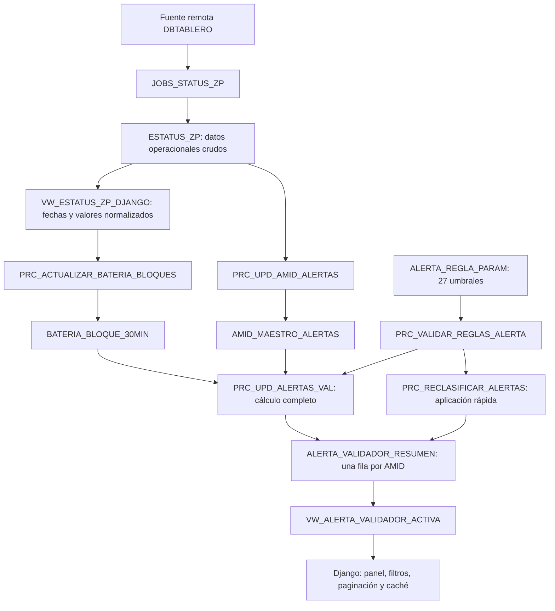

# 03 — Flujo completo Oracle–Django

## Objetivo

Este documento explica qué función cumple Oracle dentro del dashboard, cómo se transforman los datos operacionales y dónde se calculan las reglas de alertas GPS y batería.

También propone una estrategia para que Django consulte resultados preparados, evitando leer y procesar repetidamente los mismos registros.

La idea central es la siguiente:

> Oracle concentra la ingestión, normalización y agregación de los datos. Django autentica usuarios, recibe filtros y presenta resultados ya calculados.

---

## Resumen para presentación

El principio del diseño es:

> Oracle procesa y conserva resultados; Django autentica, filtra y presenta.



Hay dos caminos al cambiar una regla:

| Tipo | Qué cambia | Proceso |
|---|---|---|
| `CLASIFICACION` | El nivel asignado a métricas existentes | Validación y `PRC_RECLASIFICAR_ALERTAS`; tarda pocos segundos. |
| `DETECCION` | Qué eventos se consideran caídas o eventos válidos | Validación y `PRC_RECALCULAR_ALERTAS_SEGURO`; relee la ventana histórica. |

`ESTATUS_ZP` y `JOBS_STATUS_ZP` son objetos preexistentes que esta optimización
no modifica. Los índices autorizados se revisaron, pero no fue necesario crear
otros nuevos.

## Responsabilidad de Oracle

Oracle cumple cuatro funciones principales:

1. Recibir o copiar estados de validadores desde la fuente remota.
2. Normalizar fechas y valores que originalmente llegan como texto.
3. Preparar estructuras de consulta eficientes, como los bloques de batería de 30 minutos.
4. Calcular un resumen de alertas por AMID para que el dashboard no recalcule eventos en cada solicitud.

SQLite no reemplaza estas funciones. En este proyecto se utiliza únicamente para datos internos de Django, como usuarios, permisos, sesiones, migraciones y logs locales.

---

## Flujo operativo

Los jobs programados ejecutan la preparación de bloques y el cálculo completo
cada 30 minutos. Django nunca recorre todo el histórico para construir el Panel
Alertas: consulta la vista activa, que expone una sola fila por AMID.

Las tres estructuras de lectura son:

- `VW_ESTATUS_ZP_DJANGO`, para detalle GPS y último estado normalizado;
- `BATERIA_BLOQUE_30MIN`, para tablas y gráficos de batería;
- `VW_ALERTA_VALIDADOR_ACTIVA`, para el panel y los totales de alertas.

Los totales del panel se mantienen 60 segundos en la caché local de Django. La
caché se invalida inmediatamente después de una aplicación manual de reglas.

---

## Objetos principales

### `ESTATUS_ZP`

Es la tabla de entrada operacional del esquema `USR_LAB`.

Contiene los estados obtenidos desde:

- `DBTABLERO.ANTENA_TABLERO@CLEAMTT3PRO`.
- `DBTABLERO.ESTADO_DS_TABLERO@CLEAMTT3PRO`.

Entre sus datos están el AMID, fechas, bus, operador, patente, versiones, coordenadas GPS, porcentaje de batería y estados de los sensores.

Actualmente varios valores funcionalmente numéricos o de fecha se guardan como `VARCHAR2`. Esto obliga a normalizarlos cada vez que se consulta la vista de Django.

### `VW_ESTATUS_ZP_DJANGO`

Es la interfaz normalizada entre la información cruda y los procesos del dashboard.

Sus tareas principales son:

- Convertir fechas de texto a `DATE`.
- Reconocer más de un formato de fecha.
- Entregar `NULL` cuando un valor no es válido.
- Exponer las columnas con los nombres esperados por los servicios Python.
- Generar un identificador utilizando el `ROWID` de `ESTATUS_ZP`.

La vista facilita el consumo desde Django, pero las conversiones con expresiones regulares y `TO_DATE` tienen un costo si se repiten sobre un volumen grande.

### `BATERIA_BLOQUE_30MIN`

Almacena una fila por cada combinación de AMID y bloque de 30 minutos.

Permite distinguir correctamente entre:

- Ausencia de transmisión: `PORCENTAJE_BATERIA IS NULL` y `TIENE_DATO = 0`.
- Un valor real de batería cero: `PORCENTAJE_BATERIA = 0` y `TIENE_DATO = 1`.

Esta distinción es importante: un dato ausente no debe interpretarse como batería descargada.

El procedimiento `PRC_ACTUALIZAR_BATERIA_BLOQUES`:

1. Genera la grilla de bloques de media hora.
2. Busca el registro más cercano para cada AMID y bloque.
3. Acepta registros con una diferencia máxima de 15 minutos.
4. Si existen varios candidatos, conserva el más cercano; ante empate, el más reciente.
5. Actualiza o inserta los bloques mediante `MERGE`.
6. Elimina por defecto los bloques con más de 16 días.

Procesa dos días por defecto, aunque ambos parámetros pueden modificarse al ejecutar el procedimiento.

### `AMID_MAESTRO_ALERTAS`

Es el catálogo de AMID que participan en el cálculo de alertas.

`PRC_UPD_AMID_ALERTAS` incorpora los AMID encontrados en `ESTATUS_ZP`. Los nuevos registros quedan activos y los existentes actualizan su fecha de última actualización.

El campo `ACTIVO` permite excluir un AMID sin borrar su historial.

### `ALERTA_REGLA_PARAM`

Guarda los umbrales configurables de las alertas.

Cada regla tiene:

- una clave única;
- un valor numérico;
- una descripción;
- un indicador de activación;
- un tipo: `DETECCION` o `CLASIFICACION`;
- una fecha de actualización.

Las 27 claves requeridas deben estar activas y tener valor. `PRC_VALIDAR_REGLAS_ALERTA` impide aplicar combinaciones ausentes, negativas o incoherentes. Los cambios quedan auditados en `ALERTA_REGLA_HISTORIAL`.

### `ALERTA_VALIDADOR_RESUMEN` y vista activa

Es la tabla final del cálculo. El panel consulta `VW_ALERTA_VALIDADOR_ACTIVA`, que une el resumen con el maestro y excluye AMID inactivos sin borrar su historial.

Mantiene una sola fila por AMID gracias a la restricción única sobre esa columna. Incluye:

- Último estatus.
- Métricas GPS de hoy y del período histórico.
- Último GPS y última ocurrencia de coordenadas `0,0`.
- Racha máxima de GPS `0,0`.
- Batería actual.
- Caídas de batería y eventos en cero.
- Nivel y motivo de alerta GPS.
- Nivel y motivo de alerta de batería.
- Nivel global, motivo principal y acción sugerida.
- Fecha de actualización del cálculo.

`PRC_UPD_ALERTAS_VAL` calcula una ventana de 14 días: hoy más los 13 días anteriores.

### Ubicaciones esperadas

`UBICACION_ESPERADA_VALIDADOR` mantiene la ubicación vigente de cada AMID. Contiene coordenadas, radio permitido, zona, operador, horarios y otros datos operacionales.

`HISTORIAL_UBICACION_ESPERADA` conserva las versiones anteriores con fechas de inicio y fin de vigencia.

`PRC_LIMPIAR_HIST_UBICACION` elimina por defecto versiones cuyo fin de vigencia tiene más de 16 días.

---

## Cálculo de alertas GPS

El cálculo considera registros con latitud y longitud informadas. Un GPS se clasifica como cero únicamente cuando:

```sql
LATITUD = 0 AND LONGITUD = 0
```

Las reglas se evalúan en orden. La primera condición cumplida determina el nivel.

### Nivel crítico

Se asigna `CRITICA` cuando se cumple cualquiera de estas condiciones:

| Regla | Clave configurable | Valor predeterminado |
|---|---|---:|
| Cantidad de GPS `0,0` hoy | `GPS_CERO_HOY_CRITICA` | 22 |
| Porcentaje de GPS `0,0` hoy | `GPS_PORC_HOY_CRITICA` | 90 % |
| Mínimo de registros para aplicar el porcentaje crítico | `GPS_TOTAL_HOY_CRITICA` | 10 |
| Racha de GPS `0,0` ocurrida hoy | `GPS_RACHA_CRITICA` | 784 |

La regla porcentual requiere simultáneamente el porcentaje y el mínimo de registros.

### Nivel alto

Se asigna `ALTA` cuando se cumple cualquiera de estas condiciones y ninguna regla crítica se cumplió:

| Regla | Clave configurable | Valor predeterminado |
|---|---|---:|
| GPS `0,0` hoy, mínimo | `GPS_CERO_HOY_ALTA` | 6 |
| GPS `0,0` hoy, máximo | `GPS_CERO_HOY_ALTA_MAX` | 21 |
| Porcentaje de GPS `0,0` hoy | `GPS_PORC_HOY_ALTA` | 66,67 % |
| Mínimo de registros para aplicar el porcentaje alto | `GPS_TOTAL_HOY_ALTA` | 5 |
| Racha de GPS `0,0` ocurrida hoy | `GPS_RACHA_ALTA` | 306 |

### Nivel advertencia

Se asigna `ADVERTENCIA` cuando se cumple cualquiera de estas condiciones y no se alcanzó un nivel superior:

| Regla | Clave configurable | Valor predeterminado |
|---|---|---:|
| El último GPS reportado es `0,0` | Regla fija | — |
| GPS `0,0` hoy, mínimo | `GPS_CERO_HOY_ADV` | 1 |
| GPS `0,0` hoy, máximo | `GPS_CERO_HOY_ADV_MAX` | 5 |
| Cantidad histórica de GPS `0,0` | `GPS_CERO_HIST_ADV` | 113 |
| Porcentaje histórico de GPS `0,0` | `GPS_PORC_HIST_ADV` | 16,43 % |

Si ninguna condición se cumple, el nivel GPS queda en `OK`.

---

## Cálculo de alertas de batería

Las caídas se detectan comparando bloques consecutivos de batería que contienen datos reales.

Una caída candidata debe respetar estos valores:

| Regla | Clave configurable | Valor predeterminado |
|---|---|---:|
| Diferencia mínima para considerar una caída | `BAT_CAIDA_MIN_DETECTAR` | 20 puntos |
| Separación máxima entre muestras | `BAT_CAIDA_MAX_HORAS` | 2 horas |

### Nivel crítico

Se asigna `CRITICA` cuando se cumple cualquiera de estas condiciones:

- La mayor caída de hoy es igual o superior a 50 puntos (`BAT_CAIDA_HOY_CRITICA`).
- La última caída terminó en 0 % y ocurrió hoy.
- Se detectaron tres o más caídas hoy (`BAT_CAIDAS_HOY_CRITICA`).
- La caída máxima de hoy es de al menos 30 puntos y existe historial de caídas (`BAT_CAIDA_HOY_CRITICA_CON_HIST`).
- La batería actual es 0 % y existen al menos diez bloques en cero hoy (`BAT_CERO_HOY_CRITICA`).

### Nivel alto

Se asigna `ALTA` cuando no existe una condición crítica y se cumple alguna de estas reglas:

- La mayor caída de hoy está entre 20 y menos de 50 puntos (`BAT_CAIDA_HOY_ALTA`).
- Existen una o dos caídas hoy y también existe historial de caídas.
- Existen al menos tres caídas históricas (`BAT_CAIDAS_HIST_ALTA`).
- La caída histórica máxima es igual o superior a 50 puntos (`BAT_CAIDA_MAX_HIST_ALTA`).
- La batería actual es 0 % y existen entre tres y nueve bloques en cero hoy (`BAT_CERO_HOY_ALTA_MIN` y `BAT_CERO_HOY_ALTA_MAX`).

### Nivel advertencia

Se asigna `ADVERTENCIA` cuando no existe una condición superior y se cumple alguna de estas reglas:

- Existen uno o dos bloques de batería en cero hoy (`BAT_CERO_HOY_ADV_MIN` y `BAT_CERO_HOY_ADV_MAX`).
- Se reportaron tres o más bloques en cero hoy, pero la batería actual volvió a un valor mayor que cero.
- Existen al menos doce bloques históricos en cero (`BAT_CERO_HIST_ADV`).
- Existen una o dos caídas históricas y ninguna caída hoy.

Si ninguna condición se cumple, el nivel de batería queda en `OK`.

---

## Cálculo del nivel global

El nivel global combina la alerta GPS y la alerta de batería:

| GPS / batería | Resultado global |
|---|---|
| Al menos una `CRITICA` | `CRITICA` |
| Al menos una `ALTA`, sin críticas | `ALTA` |
| Ambas son `ADVERTENCIA` | `ALTA` |
| Solo una es `ADVERTENCIA` | `ADVERTENCIA` |
| Ambas son `OK` | `OK` |

El procedimiento también genera un motivo principal y una acción sugerida: revisar GPS, batería, ambos componentes o no realizar ninguna acción.

---

## Cómo consulta Django actualmente

### Panel Alertas

Consulta `VW_ALERTA_VALIDADOR_ACTIVA` para las tarjetas, filtros, paginación,
motivo y acción sugerida. Los totales globales se cachean durante 60 segundos.
Las solicitudes web no vuelven a ejecutar las reglas.

### Panel Baterías

Consulta:

- `VW_ESTATUS_ZP_DJANGO` para el último estado;
- `BATERIA_BLOQUE_30MIN` para tabla y gráficos;
- el resumen Oracle para los indicadores oficiales del AMID.

Python no vuelve a buscar el registro más cercano de cada bloque.

### Panel GPS

Consulta la vista normalizada dentro del rango solicitado y las tablas de
ubicación esperada. El historial detallado solo se lee cuando el usuario abre un
AMID o solicita una exportación.

---

## Edición de reglas desde Django

1. Django acepta únicamente las 27 claves permitidas.
2. Compara los valores enviados con los actuales dentro de una transacción.
3. Actualiza solo las reglas que realmente cambiaron.
4. Oracle valida la combinación antes del `COMMIT`.
5. Django selecciona proceso rápido o completo según `TIPO_REGLA`.
6. Se registra modo, duración y resultado en
   `temp_uploads/alertas_recalculo.log`.

El historial de valores vive en Oracle; el archivo local registra la ejecución.

---

## Jobs y frecuencia observada

| Job | Función | Frecuencia | Duración observada |
|---|---|---|---:|
| `JOB_ACTUALIZAR_BATERIA_BLOQUES` | Prepara bloques de batería | cada 30 minutos | ~1:06 |
| `JOB_UPD_ALERTAS_VAL` | Cálculo completo de alertas | cada 30 minutos | ~3:10 |
| `JOB_UPD_AMID_ALERTAS` | Sincroniza maestro de AMID | diario | ~0:04 |

Durante la auditoría no presentaban fallos.

---

## Rendimiento y decisiones vigentes

- Las estadísticas Oracle estaban actualizadas.
- `(AMID, FECHA_HORA_BLOQUE)` cubre la lectura principal de batería.
- `(AMID, FECHA_HORA)` reduce la vista de estatus al AMID solicitado.
- La tabla resumen tiene solo 930 filas; no necesita más índices.
- No se eliminaron índices porque también pueden servir a los jobs.
- Las conversiones de fechas de texto siguen siendo una limitación heredada de
  `ESTATUS_ZP`, pero no justificaron una modificación riesgosa.

Solo debe abrirse otra optimización cuando exista una demora reproducible, un
job fallido o una divergencia entre AMID activos y resúmenes activos.

---

## Frase de cierre para presentación

```text
Procesar una vez en Oracle -> consultar muchas veces desde Django
```

La separación mantiene las reglas centralizadas, evita resultados diferentes
entre paneles y permite optimizar cada capa de forma independiente.